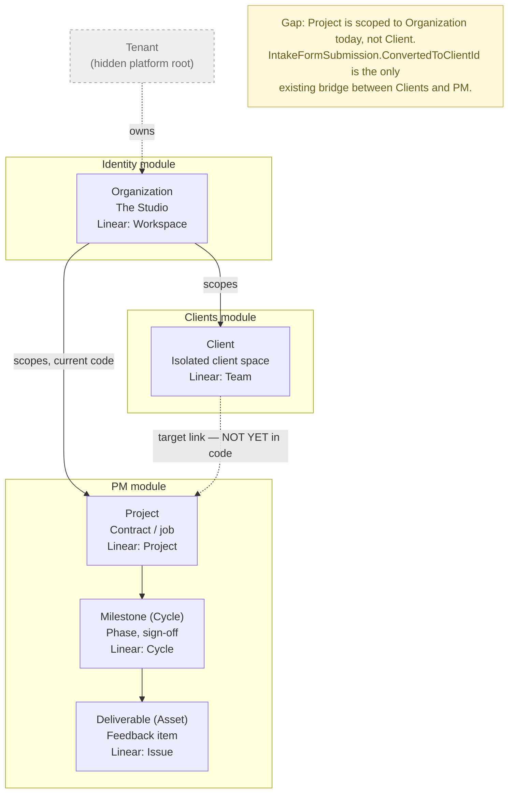
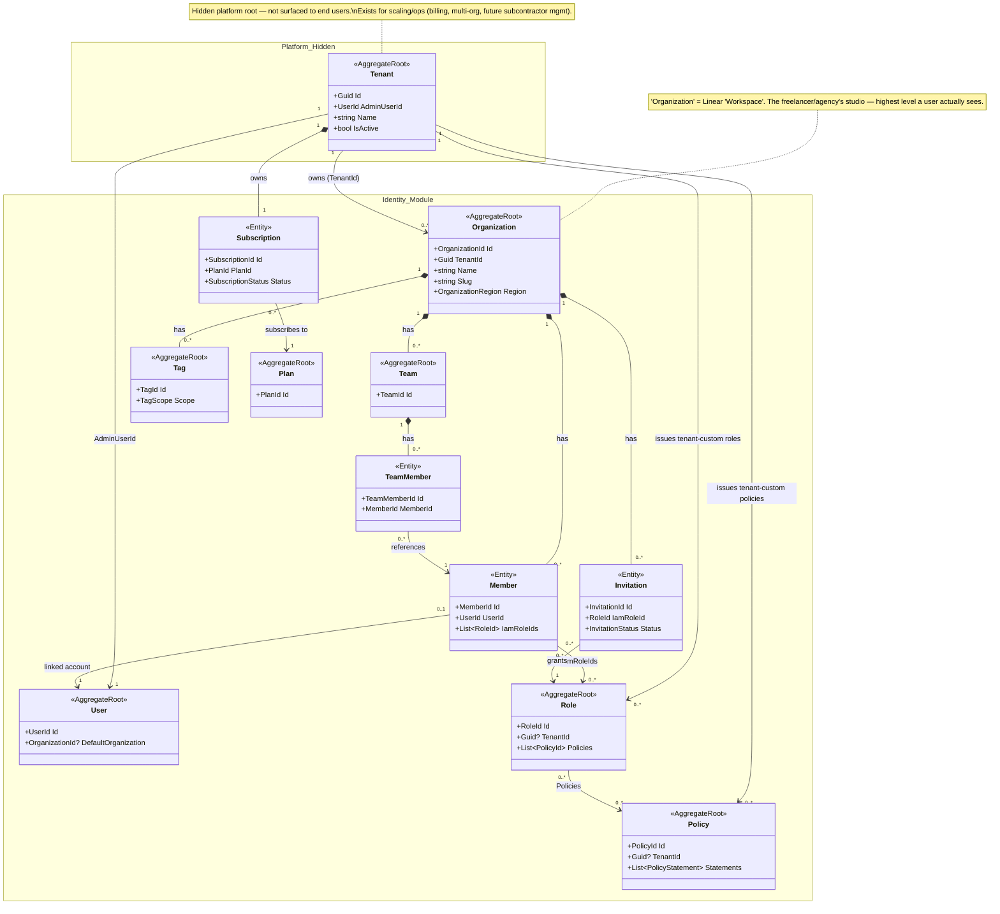
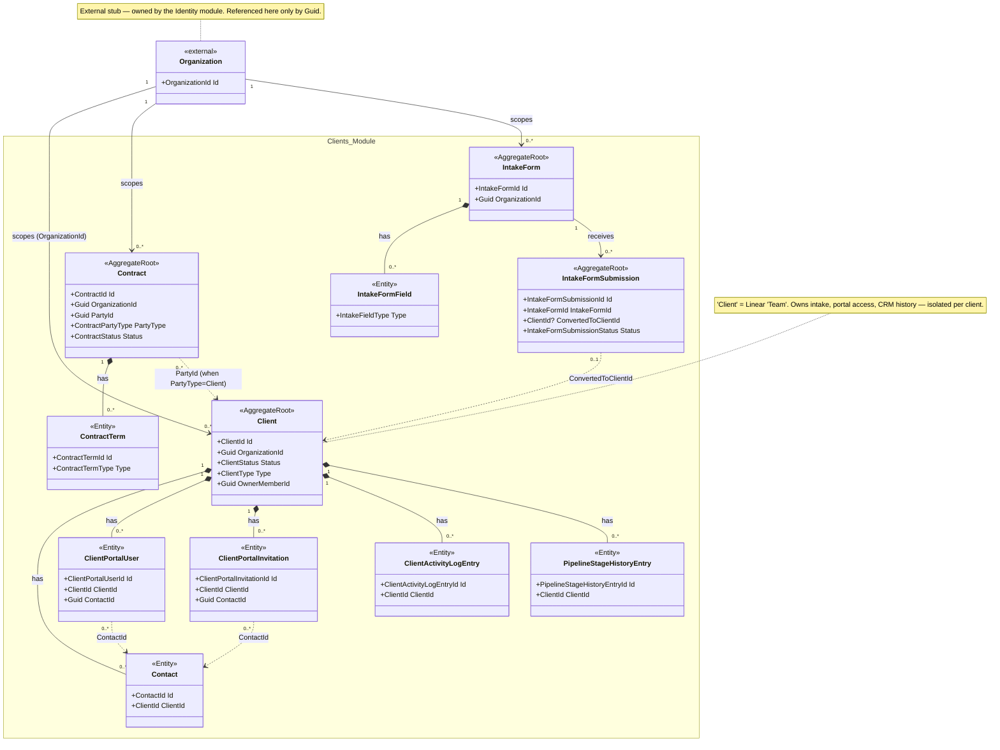

# Domain Model

How Mirama's domain objects fit together across the `Identity`, `Clients`, and `PM` modules (the `Workspace` module is under active design and left out for now).

Diagram sources: `diagrams/Core/DomainModel.mmd` (overview) plus one detail diagram per module — `DomainModel-Identity.mmd`, `DomainModel-Clients.mmd`, `DomainModel-PM.mmd`.

## The hierarchy — a Linear-style pipeline adapted for client work

Linear structures work as `Workspace → Team → Project → Cycle → Issue`. Mirama adapts that same shape into a client-facing delivery pipeline:

| Linear concept | Mirama concept | Role |
|---|---|---|
| Workspace | **Tenant** *(hidden)* | Platform-level root. Not user-facing — exists for billing, multi-org scaling, and future subcontractor management. |
| — | **Organization** | The freelancer/agency's studio. Highest level a user actually sees: manages members, teams, roles, and every client relationship. |
| Team | **Client** | An isolated space per client — backlog, brief, and communication equivalent. Owns intake submissions and CRM history. |
| Project | **Project** | A specific contract or job ("Beachside Villa Remodel"). |
| Cycle | **Milestone** (`Cycle`) | Time-boxed, client-facing phase focused on sign-off rather than sprint velocity ("Phase 1: Concept Board"). |
| Issue | **Deliverable** (`Asset`) | The atomic unit of feedback — a file, 3D embed, video timeline, or mood board item, not text/code. |

`Tenant` sits above `Organization` as a hidden class purely for future scale-out (multiple organizations per tenant, agency-of-agencies billing, etc.) — it is never exposed in product UI today.

### Overview diagram

## Module boundaries

Each level of the hierarchy that is its own module gets its own detail diagram below. Cross-module references go through plain `Guid`/typed-ID fields (`OrganizationId`, `ClientId`, `ProjectId`, …), never direct object references — each module's aggregates stay independently loadable and each bounded context stays isolated, the same pattern Linear uses to keep Teams independently scalable. In each module diagram, classes owned by another module appear only as `<<external>>` stubs carrying their id.

### Identity module (Organization level)

Owns `Tenant` (hidden platform root) and `Organization` — the Linear "Workspace" equivalent — plus everything about who can act: `Member`, `User`, `Team`, `Role`/`Policy`, `Plan`/`Subscription`, `Invitation`, `Tag`.

### Clients module (Client level)

Owns the `Client` space — the Linear "Team" equivalent. Intake forms and submissions, CRM (`Contact`, `ClientActivityLogEntry`, `PipelineStageHistoryEntry`), client portal access (`ClientPortalUser`/`ClientPortalInvitation`), and `Contract`s. `Organization` appears only as an external stub, referenced by `OrganizationId`.

### PM module (Project / Milestone / Deliverable level)

Owns `Project` execution — the Linear "Project/Cycle/Issue" equivalent. `Cycle` is the **Milestone**, `Asset` is the **Deliverable**; `Task` stays the internal, text-heavy work item (closer to a Linear Issue) while `Asset` is the client-facing item requiring visual sign-off. Also owns `ProjectTemplate` for reusable project scaffolding. `Organization` and `Client` appear only as external stubs.

```mermaid
classDiagram
    direction TB

    class Organization {
        <<external>>
        +OrganizationId Id
    }
    class Client {
        <<external>>
        +ClientId Id
    }

    namespace PM_Module {
        class Project {
            <<AggregateRoot>>
            +ProjectId Id
            +Guid OrganizationId
            +Guid StatusId
            +Guid PriorityId
        }
        class ProjectMilestone {
            <<Entity>>
            +ProjectMilestoneId Id
            +MilestoneStatus Status
        }
        class ProjectMember {
            <<Entity>>
            +ProjectMemberId Id
        }
        class ProjectTeam {
            <<Entity>>
            +ProjectTeamId Id
        }
        class Cycle {
            <<AggregateRoot>>
            +CycleId Id
            +Guid ProjectId
            +CycleStatus Status
        }
        class KanbanBoard {
            <<AggregateRoot>>
            +KanbanBoardId Id
            +Guid ProjectId
        }
        class KanbanColumn {
            <<Entity>>
            +KanbanColumnId Id
        }
        class WorkflowConfig {
            <<AggregateRoot>>
            +WorkflowConfigId Id
            +ProjectId ProjectId
        }
        class StatusConfig {
            <<Entity>>
            +StatusConfigId Id
            +StatusCategory Category
        }
        class PriorityConfig {
            <<Entity>>
            +PriorityConfigId Id
        }
        class Task {
            <<AggregateRoot>>
            +TaskId Id
            +Guid ProjectId
            +TaskId? ParentTaskId
            +TaskType Type
            +Guid StatusId
            +Guid PriorityId
        }
        class TaskComment {
            <<Entity>>
            +TaskCommentId Id
            +TaskId TaskId
        }
        class TaskDependency {
            <<Entity>>
            +TaskDependencyId Id
            +TaskId BlockingTaskId
            +DependencyType Type
        }
        class TimeLog {
            <<Entity>>
            +TimeLogId Id
        }
        class Asset {
            <<AggregateRoot>>
            +AssetId Id
            +Guid? ProjectId
            +AssetVersionId? CurrentVersionId
            +AssetType Type
            +AssetStatus Status
        }
        class AssetVersion {
            <<Entity>>
            +AssetVersionId Id
        }
        class AssetFeedback {
            <<Entity>>
            +AssetFeedbackId Id
            +AssetFeedbackStatus Status
        }
        class FeedbackReply {
            <<Entity>>
            +FeedbackReplyId Id
        }
        class FeedbackAnnotation {
            <<Entity>>
        }
        class AssetConnection {
            <<Entity>>
            +AssetConnectionId Id
            +AssetConnectionTarget Target
        }
        class ProjectTemplate {
            <<AggregateRoot>>
            +ProjectTemplateId Id
            +Guid OrganizationId
        }
        class MilestoneTemplate {
            <<Entity>>
            +MilestoneTemplateId Id
        }
        class TaskTemplate {
            <<Entity>>
            +TaskTemplateId Id
        }
        class CycleTemplate {
            <<Entity>>
            +CycleTemplateId Id
        }
    }

    Organization "1" --> "0..*" Project : scopes (OrganizationId)
    Client "0..*" ..> Project : target link — NOT YET in code
    Project "1" *-- "0..*" ProjectMilestone : has
    Project "1" *-- "0..*" ProjectMember : has
    Project "1" *-- "0..*" ProjectTeam : has
    Project "1" --> "0..1" WorkflowConfig : configures via
    WorkflowConfig "1" *-- "0..*" StatusConfig : has
    WorkflowConfig "1" *-- "0..*" PriorityConfig : has
    Project "1" --> "0..*" Cycle : ProjectId
    Project "1" --> "0..*" KanbanBoard : ProjectId
    KanbanBoard "1" *-- "0..*" KanbanColumn : has
    Project "1" --> "0..*" Task : ProjectId
    Task "0..1" --> "0..*" Task : ParentTaskId (subtasks)
    Task "1" *-- "0..*" TaskComment : has
    Task "1" *-- "0..*" TaskDependency : has
    Task "1" *-- "0..*" TimeLog : has
    Cycle "0..*" --> "0..*" Task : contains
    Project "0..1" --> "0..*" Asset : ProjectId (deliverables)
    Asset "1" *-- "0..*" AssetVersion : has
    Asset "1" *-- "0..*" AssetFeedback : has
    AssetFeedback "1" *-- "0..*" FeedbackAnnotation : has
    AssetFeedback "1" *-- "0..*" FeedbackReply : has
    Asset "1" *-- "0..*" AssetConnection : has
    Organization "1" --> "0..*" ProjectTemplate : scopes
    ProjectTemplate "1" *-- "0..*" MilestoneTemplate : has
    ProjectTemplate "1" *-- "0..*" TaskTemplate : has
    ProjectTemplate "1" *-- "0..*" CycleTemplate : has

    note for Cycle "'Cycle' = plan's 'Milestone'. Time-boxed, client-facing phase focused on sign-off."
    note for Asset "'Asset' = plan's 'Deliverable'. Task = internal work item (closer to Linear 'Issue')."
    note for Organization "External stub — owned by the Identity module. Referenced here only by Guid."
    note for Client "External stub — owned by the Clients module. Target link not yet implemented."
```

## Current gap vs. the target shape

**`Project` is scoped directly to `Organization` today, not to `Client`.** The `Clients` and `PM` modules don't have a `ClientId` link between them yet — `IntakeFormSubmission.ConvertedToClientId` is the only bridge that exists (a submission converts into a `Client`). Wiring `Project` under `Client` is the next step to close the gap between current code and the target pipeline described above. See the dotted `Client -. target link .-> Project` edge in the overview diagram.
