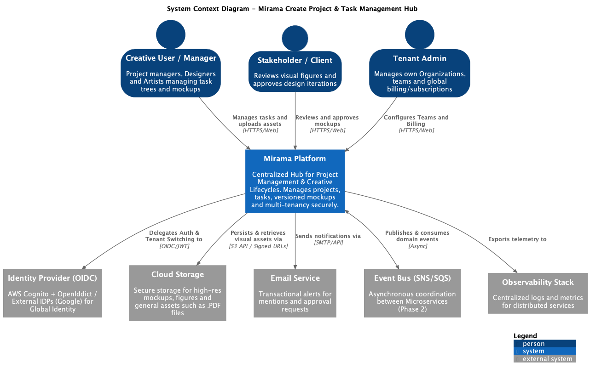

# System Context: Mirama

## Centralizing the Creative Lifecycle

Mirama is built for the "Visual-First" workflow. While traditional agile tools treat images as secondary attachments, Mirama treats Mockups, Figures, and Illustrations as the core data. Our use cases are designed to guide a creative project from a blurry "Early Concept" to a pixel-perfect "Final Asset" without losing the history of the evolution.

## Why Mirama Stands Out

Most small creative businesses struggle with "Asset Fragmentation"—briefs in email, mockups in Figma, and feedback in Slack. Mirama centralizes this.

### 1. The "Visual-First" Task Engine

**The Business Goal:** Stop hunting for files. Every task in the hierarchy acts as a container for the evolution of an idea.

**Use Case: Recursive Asset Evolution**

The Action: A user creates a "Website Redesign" task. They nest a "Homepage Hero" sub-task. Instead of just a status, this task displays the Evolution Gallery: Version 1 (Wireframe), Version 2 (Low-fi Mockup), and Version 3 (High-res Figure).

The Value: Stakeholders see the path of the design, not just the current state.

Technical Shift:
* Phase 1 (MVP): Basic image uploads linked to tasks.
* Phase 2 (C#/.NET): Advanced Blob storage integration with automated thumbnail generation and "Version Stacking" logic in the Project Service.

### 2. Multi-Tenant Studio Logic

**The Business Goal:** A single freelancer or agency managing high-res assets for 5+ clients without crossing the streams.

**Use Case: The "Brand-Isolated" Context Switch**

The Action: Switching from "Client A" to "Client B."

The Visual Context: Not only do the tasks change, but the Asset Library and Brand Presets (Figures/Icons) completely reset to the new tenant's boundary.

Security Choice: We use OpenIddict to ensure that a JWT issued for Client A physically cannot be used to fetch a private mockup URL for Client B.

### 3. Stakeholder Review & Visual Approval (The New Focus)

**The Business Goal:** Closing the loop between the designer's "Export" and the client's "Approval."

**Use Case: The "Annotated Review" Flow**

The Action: A client or lead designer opens a "Figure" or "Mockup" within a task and leaves feedback directly on the visual asset.

The Workflow: Marking a task as "Ready for Review" triggers a notification that centers the Latest Figure in the UI, allowing for a side-by-side comparison of the "Brief" vs. the "Execution."

The Impact: Reduces "Feedback Loops" by ensuring the reviewer is looking at the correct iteration of the asset within the context of the task requirements.
