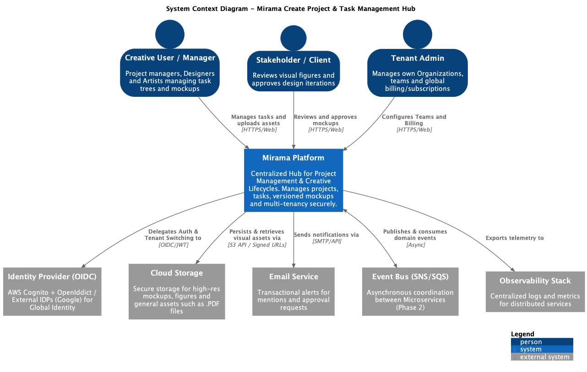

# Mirama Platform – System Context

This document provides a high-level overview of the Mirama Platform, outlining its purpose, stakeholders, key assumptions, core use cases and architectural context. It serves as a foundation for understanding how Mirama fits into the broader business and technical landscape.

---

## Purpose

Mirama is an end-to-end client and project operating system for freelancers and micro-agencies who delegate paid client work to subcontractors. It covers the full lifecycle of a client engagement in one platform: capturing a lead through an intake form, executing the project with visual task boards and asset proofing tools, bringing in trusted subcontractors without exposing client budgets or other people's rates, collaborating with the client through a protected portal, and closing the engagement with automatic Stripe billing and split payouts.

The niche is intentionally focused. Mirama is built for the moment a solo operator stops working alone, a designer bringing in a motion artist, a dev lead bringing in a backend contractor, a fractional CMO bringing in a paid-media freelancer. The project, the client relationship, the subcontractor's slice of the work and the invoice are all connected. It is visual-first by default but functions equally well as a pure project and task management tool for non-visual, non-creative work such as fractional executive or consulting engagements.

The platform is designed to be immediately useful to a solo freelancer and scale to a mid-size agency of 100+ people without requiring a migration or a plan change to access the foundation. The underlying data model and permission system work the same at every size, and the same model that isolates one client's data from another isolates one subcontractor's assignment from another.

---

## Target Verticals

Mirama is not a generic project management tool. It is built for a specific relationship: a lead freelancer or micro-agency who owns the client relationship and delegates part of the delivery work to subcontractors, across creative and non-creative disciplines alike. The pain points these businesses share are identical regardless of the specific medium: client intake happens in email, projects are tracked in one tool, files are shared through another, client review and approval happen in a third, subcontractors are paid from memory once the client has paid, and billing is assembled manually at the end from scattered data.

| Vertical | Primary Deliverables | Scale Fit |
|---|---|---|
| Design & brand studios | Logos, identity systems, brand guidelines, print and digital assets | Solo to 200+ |
| Web development agencies | Websites, web apps, landing pages, interactive prototypes | Solo to 200+ |
| Video & film production | Commercials, branded content, social video, documentary | Solo to 200+ |
| Marketing & campaign agencies | Campaign assets, social content, ad creatives, content calendars | Solo to 200+ |
| Architecture & interior design | Renders, blueprints, mood boards, material palettes, presentation decks | Solo to 200+ |
| Motion & animation studios | Explainer videos, motion graphics, title sequences, animated ads | Solo to 200+ |
| Photography studios | Photo galleries, retouched images, lookbooks, editorial shoots | Solo to 75+ |
| Fractional executives & consultants | Retainer-based strategy, technical, marketing or financial execution, often blended with subcontracted specialist work | Solo to 75+ |

The platform is not intended for industries without a client-facing engagement organized around delegated project delivery, for example large in-house teams, retail operations or product companies without an external client relationship at the center of the work. Those verticals have different tooling needs that Mirama is not designed to address.

---

## Stakeholders

- **Solo Freelancers:** The foundational target. Need professional client intake, billable time tracking, Stripe-connected invoicing, and a client portal that makes a one-person operation look and run like a full agency, before they bring in their first subcontractor. Every platform feature must work cleanly at this tier before it is considered complete.
- **Delegating Leads & Boutique Studios (1–20 people):** Need project templates, cross-project workload visibility, shared client portals, and a scoped subcontractor identity so bringing in a specialist to help deliver client work doesn't mean exposing client budgets or other people's rates. The jump from solo to delegating lead should require no process changes, just inviting a subcontractor into an existing project.
- **Subcontractors & Delegated Collaborators:** Brought onto a specific project by a lead or a fractional executive to deliver part of the work. Not the account owner, and often working with several different leads across different platforms at the same time. Need a scoped invitation that only exposes their assigned tasks, assets and their own payout status, clear scope and fee terms attached to the work itself rather than captured over email, and confidence that payout happens automatically once the client approves and pays.
- **Mid-Size Agencies (20–75 people):** Need multi-team capacity planning, structured client approval workflows, per-client profitability reporting, and the ability to manage multiple client-facing organizations under one account while keeping their data, and each subcontractor's assignment, fully isolated from everyone else's.
- **Established Studios & Firms (75–200+ people):** Need fine-grained role-based access control across departments and teams, audit logs for accountability, organization-level analytics covering revenue, utilization and project health, and onboarding workflows that scale to new clients and projects without manual configuration overhead.
- **End Clients / External Stakeholders:** Customers and project clients who interact through the client portal. They review progress, leave feedback on watermarked asset previews, and approve milestones without accessing internal budget data, team discussions, subcontractor identities, rates or full-resolution files.
- **Developers:** Internal engineering teams responsible for building, maintaining and evolving the platform.
- **Business Owners / Project Sponsors:** Product managers and leadership overseeing platform direction and ROI.
- **Support & Operations:** Teams responsible for platform uptime, support and customer success.

---

## Key Assumptions

- **Relational Client Model:** The `Client` entity is a first-class object in the database, linked to intake briefs, projects, time records and invoices. Siloed data structures break billing and reporting - this is a foundational constraint.
- **Freelancer-First:** Every feature must make sense for a single-person operation before it is considered complete. Team, delegation and enterprise capabilities are extensions of a solid solo foundation, not separate modes.
- **Delegation-Aware by Design:** The moment a lead brings in a subcontractor, access and payouts scope down automatically through a dedicated Subcontractor tier, sitting alongside the existing CLIENT scope. Client financials and other collaborators' rates stay private without the lead having to manage that separation by hand.
- **Asset Protection by Default:** Client previews are automatically watermarked and served at reduced quality. Full-resolution delivery is a deliberate action. This is a product and security requirement, not an optional feature.
- **Billing and Payouts Are Connected, Not Bolted On:** Stripe billing, invoicing and split payouts to subcontractors are connected to time tracking and project milestones from the start. They are not a separate module added later.
- **Cloud-Native:** The platform uses AWS infrastructure for scalability, reliability and global reach, adhering to the AWS Well-Architected framework.
- **Security:** Strict tenant and organization isolation is enforced at all layers, with PBAC authorization for fine-grained access control within each organization and separate CLIENT and Subcontractor scopes for external stakeholders and delegated collaborators.
- **Open by Default:** An open API and webhook system is part of the platform contract. Users will integrate with Slack, Adobe Creative Cloud, Google Drive and other tools even if Mirama covers the core workflow.
- **Iterative Delivery:** CRM, PM and billing capabilities are the immediate priority, with delegated work and scope protection the highest priority area beyond the execution core already in place. Analytics, advanced reporting and the AI layer follow once that foundation is solid.

---

## Core Use Cases & Features

### Use Case Diagrams

Below are three primary use case diagrams representing the most important workflows in Mirama.

#### 1. Project & Asset Lifecycle Management

**Description:**  
This diagram illustrates how users create projects, manage recursive task and asset hierarchies, upload and version assets, and collaborate through inline annotation and approvals. It covers the core workflow for service delivery teams, and the subcontractors they bring in, from brief creation through to final delivery and billing.

#### 2. Multi-Tenant Access & Collaboration

**Description:**  
This diagram focuses on user authentication, context switching between organizations, team-based access control, and delegated invitations, covering both the client portal for external stakeholders reviewing watermarked deliverables and a separate scoped invitation for subcontractors brought in to help deliver part of the work.

#### 3. Review, Approval & Notification Workflow

**Description:**  
This diagram shows the review and approval process: native proofing with click-on-spot annotation, version comparison, watermarked secure asset sharing, milestone tracking, scope guardrails that flag revisions pushing past an agreed limit, and the feedback loop between internal teams, subcontractors and clients that gates billing milestones and subcontractor payouts.

---

### Must-Have Core Features

**Execution Engine:**
- **Recursive Task Hierarchies:** Workspace → Client → Project → Task → Sub-task; N-level deep with progress aggregation.
- **Flexible Views:** Kanban boards (high-velocity work), Gantt/timeline (campaign planning and dependencies), Calendar (content-heavy teams).
- **Task Dependencies:** Dependency tracking with automatic downstream shift when upstream tasks are delayed.
- **Custom Statuses:** Support for "Internal Review," "Client Review," "Awaiting Assets," "Approved" and user-defined production stages.

**Asset Collaboration & Proofing:**
- **Large Asset Upload:** Files up to 1GB via direct-to-S3 multipart uploads with resume support.
- **Native Proofing & Annotation:** Click-on-spot comments on images, PDFs and video - eliminating the need for Frame.io or Markup.io.
- **Version Control:** Stacked version history (v1, v2, v3) with instant switching; the team always works from the active version.
- **Asset Protection:** Client-facing previews are automatically watermarked and served as low-quality proxies. Full-resolution assets are only accessible after explicit delivery action.
- **Contextual Task-Level Discussion:** Comments live inside the task, not in a general channel.
- **Rich Media Embedding:** Briefs support embedded Figma files, Loom videos and mood boards.

**Client & Intake Management (CRM):**
- **Custom Intake Forms:** External forms for clients to submit briefs that automatically create a Lead or Project.
- **Client Portal / Guest Access:** A simplified view where clients see progress, leave feedback on watermarked previews, and approve work without seeing internal budget data, team discussions or subcontractor identities.
- **Public/Private Privacy Toggles:** Control which tasks and comments are visible in the client portal.
- **Lead-to-Project Conversion:** A brief submitted via intake form flows directly into a structured project, preserving the client relationship link throughout.

**Delegated Work & Subcontractor Payouts:**
- **Scoped Subcontractor Access:** A dedicated invitation and access tier for subcontractors that only exposes their assigned tasks, assets and their own payout status, keeping client budgets and other subcontractors' rates hidden by construction rather than by after-the-fact filtering.
- **Scope Guardrails & Change Orders:** Revision limits and scope boundaries defined per milestone, prompting a priced, client-approved change order the moment feedback pushes a deliverable past its agreed scope.
- **Blast Radius Analysis:** Given a proposed change to a date, an asset or a scope item, the system shows every downstream task, subcontractor and fee affected before the change is committed.
- **Split Payouts on Approval:** Automatic payout splitting between the lead and assigned subcontractors through Stripe Connect the moment a milestone is approved and paid.

**Billing & Financial Visibility:**
- **Stripe-Connected Invoicing:** Automatic invoice generation connected to tracked time and approved milestones, with Stripe handling payment collection.
- **Native Time Tracking:** A built-in timer on tasks; this data feeds invoice line items, profitability summaries and subcontractor payout splits.
- **Billable vs. Non-Billable Toggle:** Separates client revenue from internal overhead.
- **Budget Burn Alerts:** Notifications at 50%, 75% and 100% of allocated hours or budget.
- **Project Profitability Snapshot:** Revenue billed vs. hours logged vs. budget allocated - visible per project.
- **Capacity / Workload View:** Manager-level view showing who is overbooked or available across all active projects, subcontractors included.

**Analytics & Audit:**
- **Project Health Dashboards:** Status, budget burn, milestone progress and overdue tasks at a glance.
- **Client Revenue Tracking:** Billed amount per client and project across a date range.
- **Utilization Reports:** Billable hours ratio per team member.
- **Audit Logs:** Immutable event trail for all destructive or sensitive actions - who changed a deadline, deleted a file, modified permissions, or adjusted a subcontractor payout split.

**Automation & Scale:**
- **Project Templates:** One-click setups for standard service packages (e.g., "Brand Identity," "Website Launch," "Video Commercial," "Campaign Assets") with pre-set tasks, roles and durations.
- **Automated Triggers:** Rule-based actions - e.g., "When milestone is Approved, generate Stripe invoice and notify client."
- **Global Search:** Searches across task names, file names and comment text in a single query.

**Technical Foundation:**
- **Relational Client Object:** Client links to Briefs (CRM), Projects (PM), Time Records and Invoices (Billing) from day one.
- **Open API & Webhooks:** Integration surface for Slack, Adobe Creative Cloud, Google Drive and custom workflows.

### Nice-to-Have Features

- **AI-Driven Asset Tagging:** Automated metadata extraction and smart search across large asset libraries.
- **Advanced Client Analytics:** Client lifetime value, project win rate from intake, average project duration.

---

## System Context Diagram (C4 Model – System Context)

---

## External Systems & Integrations

- **Stripe:** Payment processing, automatic invoicing and split payouts to subcontractors via Stripe Connect.
- **AWS Cloud:** S3 (asset storage and proxy delivery), RDS (database), ElastiCache (caching), ECS (compute), SNS/SQS (queues), CloudFront (CDN and watermarked asset delivery).
- **Google IdP & Calendar:** Authentication and calendar synchronization.
- **Email/SMS Providers:** Notifications, invitations and alerts.
- **Design & Creative Tools:** Figma (embed), Loom (embed), Adobe Creative Cloud (webhook integration, future).
- **Communication Tools:** Slack (webhook notifications, future).

---

## Security & Compliance

- **Tenant & Organization Isolation:** Enforced at all API, storage and UI layers via the ScopedDb pattern.
- **CLIENT Scope:** External project clients access only explicitly shared, watermarked deliverables through invitation-based tokens. No org-level visibility.
- **Subcontractor Scope:** External delegated collaborators access only their assigned tasks, assets and their own payout record through invitation-based tokens, structurally mirroring the CLIENT scope. No visibility into client financials, other subcontractors' rates or the wider organization.
- **Stateless JWT Authentication:** All services validate tokens independently via OpenIddict (backend) and NextAuth (frontend).
- **Policy-Based Access Control (PBAC):** Fine-grained permissions for teams, projects and assets with a Redis-flattened permission matrix for O(1) authorization checks.
- **Encryption:** All data encrypted at rest and in transit.
- **Audit Logs:** Immutable event trail for all destructive or sensitive actions.

---

## Summary

Mirama is the operational backbone for freelancers and micro-agencies who delegate client work to subcontractors, built around the full engagement lifecycle from lead through delivery through payout, not just the task board in the middle of it. Its visual-first approach, connected billing and payout layer, and asset protection model serve professionals across creative and non-creative disciplines who bring in trusted specialists to help deliver client work. The modular architecture, cloud-native infrastructure and freelancer-first design ensure the platform is immediately useful on day one, whether working alone or with a subcontractor, and scales cleanly as the business grows.
