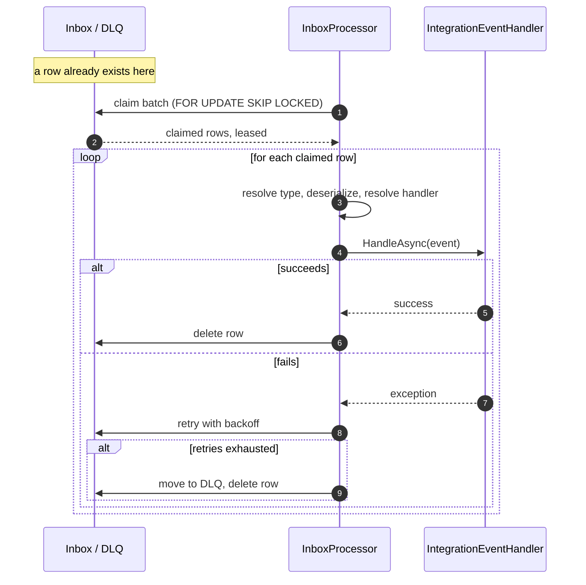

# Inbox Flow - Sequence Diagram

This picks up exactly where `background-jobs-outbox-flow.md` ends: a row already exists in some module's own Inbox. It corresponds to `background-jobs-inbox-design.md`. It says nothing about how that row got there - that's the outbox's job, covered separately.

Two things worth keeping in view when reading this against the outbox diagram: nothing here knows or cares whether this module raised the underlying domain event itself or received it from another module's fan-out - Part 1 of the design doc explains why that distinction is deliberately erased by the time execution reaches this point. And a second module's inbox processing the same underlying event is a completely separate run of this same diagram, against that module's own Inbox, with its own retry count and its own dead letters - never shown here because it has no interaction with this one at all.
