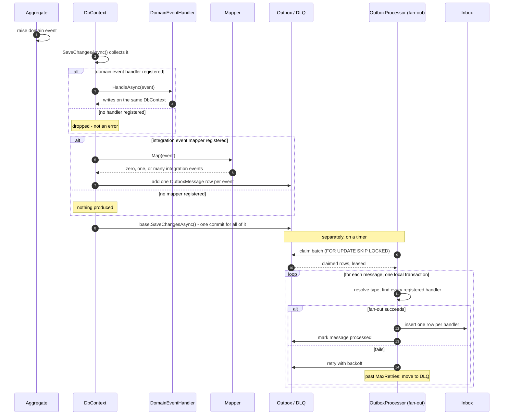

# Outbox Flow - Sequence Diagram

This traces one domain event from the moment an aggregate raises it through to fan-out: the point where it becomes one row per interested handler in some module's Inbox. It corresponds to `background-jobs-outbox-design.md`. What happens to an Inbox row afterward - claiming it, running its handler, retrying, ordering, dead-lettering - is a separate diagram: `background-jobs-inbox-flow.md`.

Two independent gates decide what a domain event produces:

- Whether a **domain event handler** is registered for it - if so, it runs synchronously, inside the same transaction, before it commits.
- Whether an **integration event mapper** is registered for it - not whether an integration event *type* happens to exist in code, but whether a mapper is actually wired up to produce one from this specific domain event. No mapper means nothing is ever written to the outbox.

Fan-out below inserts one row into the Inbox per interested handler - it makes no difference whether a handler lives in the same module that raised the original event or a different one; see the design doc, Part 4.

A processed message is marked, not deleted - a separate worker archives it to a history table later, on its own much slower schedule; see the design doc, Part 9. That worker isn't shown below since it runs independently of this flow.

